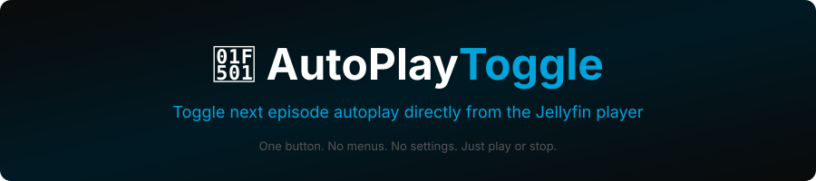

<div align="center">



<br/><br/>

[](https://jellyfin.org)
[](LICENSE)
[](#supported-languages)
[](https://github.com/n00bcodr/Jellyfin-JavaScript-Injector)

<br/>

**[🌐 Webová stránka](https://fabianoortega-ops.github.io/jellyfin-autoplay-toggle) · [📦 Instalovat](#installation) · [🌍 Jazyky](#supported-languages) · [🐛 Problémy](https://github.com/fabianoortega-ops/jellyfin-autoplay-toggle/issues)**

<br/>

---

### 🌍 Překlady
[🇬🇧 English](README.md) · [🇧🇷 Português](README.pt.md) · [🇩🇪 Deutsch](README.de.md) · [🇫🇷 Français](README.fr.md) · [🇪🇸 Español](README.es.md) · [🇮🇹 Italiano](README.it.md) · [🇷🇺 Русский](README.ru.md) · [🇨🇳 中文](README.zh.md) · [🇯🇵 日本語](README.ja.md) · [🇰🇷 한국어](README.ko.md) · [🇵🇱 Polski](README.pl.md)  
*Chcete přidat svůj jazyk? [Otevřete PR!](https://github.com/fabianoortega-ops/jellyfin-autoplay-toggle/pulls)*

---

</div>

## 🎯 Co to dělá

AutoPlay Toggle přidá **tlačítko 🔁** mezi tlačítko oblíbených a titulků v přehrávači videa Jellyfin.

```
  ♥  🔁  CC  🎵  ─────────  ⚙  ⛶
       ↑
  AutoPlay Toggle
```

- **Světlá ikona** → automatické přehrávání další epizody **zapnuto**
- **Tmavá ikona** → automatické přehrávání další epizody **vypnuto**
- Změny se projeví okamžitě a zachovají se ve všech relacích

---

## ✨ Features

| Feature | Description |
|---|---|
| 🎮 **In-Player Button** | Sits between ♥ and CC — right where you need it |
| ⚡ **Instant Toggle** | Changes apply immediately, no page reload |
| 🌍 **25 Languages** | Auto-detects your browser language |
| 🔧 **REST API** | `GET /AutoPlay/Status` · `POST /AutoPlay/Toggle` |
| 📊 **Dashboard Panel** | Also accessible from the Jellyfin sidebar |
| 🚀 **Hot Reload** | UI updates via `git push` — no server restart needed |

---

## 📦 Installation

> **Requires** the [JavaScript Injector](https://github.com/n00bcodr/Jellyfin-JavaScript-Injector) plugin by n00bcodr. Install it first from the Jellyfin Catalog.

**1. Add the repository**

Go to **Dashboard → Plugins → Repositories → +** and add:

```
https://fabianoortega-ops.github.io/jellyfin-autoplay-toggle/manifest.json
```

**2. Install the plugin**

Go to **Catalog**, find **AutoPlay Toggle** and click **Install**.

**3. Restart Jellyfin**

Restart once to load the plugin. The 🔁 button will appear automatically in the player.

---

## 🌍 Supported Languages

| Language | Code | On | Off |
|---|---|---|---|
| English | `en` | Next episode: On | Next episode: Off |
| Português | `pt` | Próximo episódio: Ligado | Próximo episódio: Desligado |
| Deutsch | `de` | Nächste Folge: Ein | Nächste Folge: Aus |
| Français | `fr` | Épisode suivant: Activé | Épisode suivant: Désactivé |
| Español | `es` | Siguiente episodio: Activado | Siguiente episodio: Desactivado |
| Italiano | `it` | Episodio successivo: Attivo | Episodio successivo: Inattivo |
| Nederlands | `nl` | Volgend aflevering: Aan | Volgend aflevering: Uit |
| Русский | `ru` | Следующий эпизод: Вкл | Следующий эпизод: Выкл |
| 中文 | `zh` | 下一集：开启 | 下一集：关闭 |
| 日本語 | `ja` | 次のエピソード: オン | 次のエピソード: オフ |
| 한국어 | `ko` | 다음 에피소드: 켜짐 | 다음 에피소드: 꺼짐 |
| Polski | `pl` | Następny odcinek: Włączone | Następny odcinek: Wyłączone |
| Svenska | `sv` | Nästa avsnitt: På | Nästa avsnitt: Av |
| Norsk | `nb` | Neste episode: På | Neste episode: Av |
| Dansk | `da` | Næste afsnit: Til | Næste afsnit: Fra |
| Suomi | `fi` | Seuraava jakso: Päällä | Seuraava jakso: Pois |
| Čeština | `cs` | Další epizoda: Zapnuto | Další epizoda: Vypnuto |
| Slovenčina | `sk` | Ďalšia epizóda: Zapnuté | Ďalšia epizóda: Vypnuté |
| Magyar | `hu` | Következő rész: Be | Következő rész: Ki |
| Română | `ro` | Episodul următor: Activat | Episodul următor: Dezactivat |
| Türkçe | `tr` | Sonraki bölüm: Açık | Sonraki bölüm: Kapalı |
| العربية | `ar` | الحلقة التالية: تشغيل | الحلقة التالية: إيقاف |
| Українська | `uk` | Наступний епізод: Увімк | Наступний епізод: Вимк |
| Ελληνικά | `el` | Επόμενο επεισόδιο: Ενεργό | Επόμενο επεισόδιο: Ανενεργό |
| Català | `ca` | Episodi següent: Activat | Episodi següent: Desactivat |

---

## 💬 Community

| Platform | Link |
|---|---|
| 💬 Discord (Official) | [discord.gg/zHBxVSXdBV](https://discord.gg/zHBxVSXdBV) |
| 💬 Discord (Community) | [discord.gg/N3M99fNxbK](https://discord.gg/N3M99fNxbK) |
| 🌐 Forum | [forum.jellyfin.org](https://forum.jellyfin.org) |
| 🔷 Matrix | [#jellyfin:matrix.org](https://matrix.to/#/#jellyfin:matrix.org) |
| 🟠 Reddit | [r/jellyfin](https://www.reddit.com/r/jellyfin) · [r/JellyfinCommunity](https://www.reddit.com/r/JellyfinCommunity) |

---

## 🔗 Related

- [JavaScript Injector](https://github.com/n00bcodr/Jellyfin-JavaScript-Injector) — Required dependency.
- [Jellyfin Enhanced](https://github.com/MakD/jellyfin-enhanced) — Adds ratings, badges, OSD improvements and more.
- [Intro Skipper](https://github.com/intro-skipper/intro-skipper) — Automatically skips intros and credits.
- [awesome-jellyfin](https://github.com/awesome-jellyfin/awesome-jellyfin) — A curated list of Jellyfin plugins and tools.
- [Jellyfin](https://github.com/jellyfin/jellyfin) — The free media system this plugin is built for.

---

## 🤝 Contributing

- 🌍 **Translate** — add a `README.xx.md` for your language
- 🐛 **Report bugs** — [open an issue](https://github.com/fabianoortega-ops/jellyfin-autoplay-toggle/issues)
- 💡 **Suggest features** — ideas are welcome
- ⭐ **Star the repo** — helps others discover it

---

<div align="center">

Made with ♥ for the [Jellyfin](https://jellyfin.org) community

[MIT License](LICENSE) · [Website](https://fabianoortega-ops.github.io/jellyfin-autoplay-toggle) · [Releases](https://github.com/fabianoortega-ops/jellyfin-autoplay-toggle/releases)

</div>
